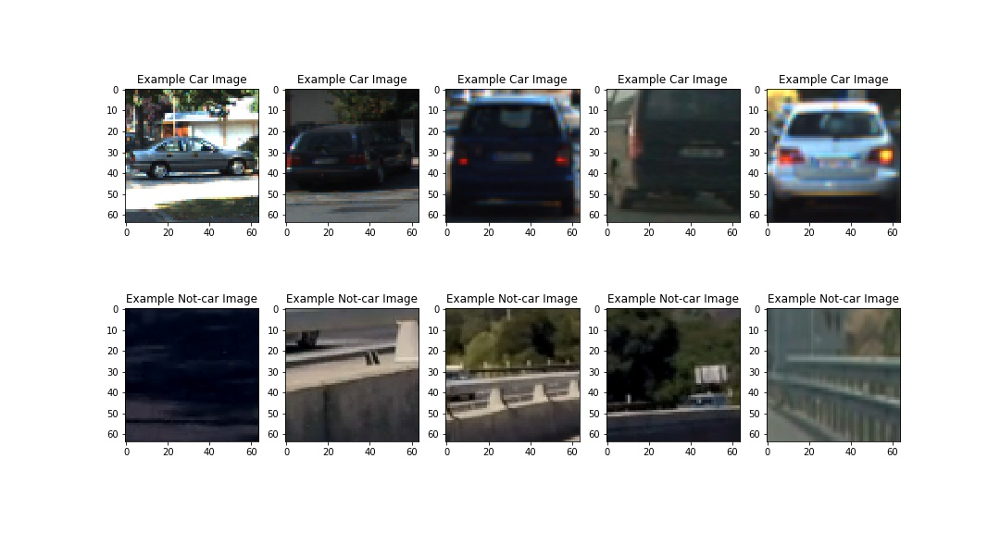
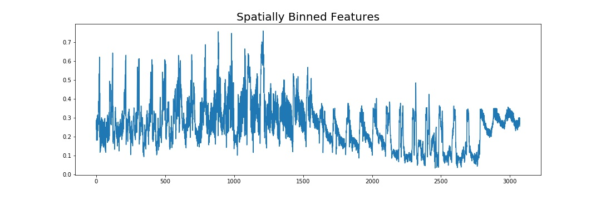
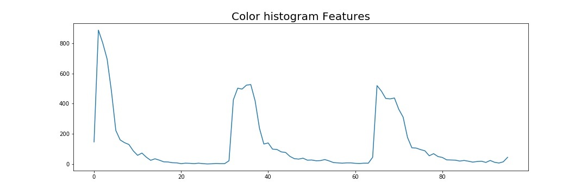
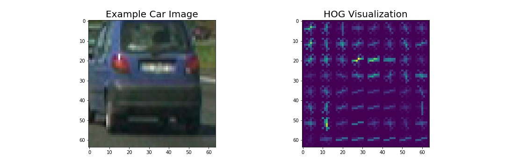
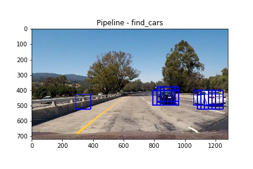
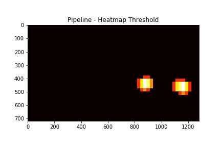
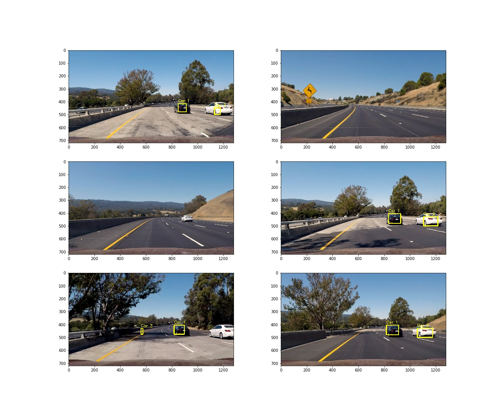

## Vehicle Car Detection

---

The goals / steps of this project are the following:

* Perform a Histogram of Oriented Gradients (HOG) feature extraction on a labeled training set of images and train a classifier Linear SVM classifier
* Optionally, you can also apply a color transform and append binned color features, as well as histograms of color, to your HOG feature vector. 
* Note: for those first two steps don't forget to normalize your features and randomize a selection for training and testing.
* Implement a sliding-window technique and use your trained classifier to search for vehicles in images.
* Run your pipeline on a video stream (start with the test_video.mp4 and later implement on full project_video.mp4) and create a heat map of recurring detections frame by frame to reject outliers and follow detected vehicles.
* Estimate a bounding box for vehicles detected.

---
### The training dataset
These example images come from a combination of the GTI vehicle image database, the KITTI vision benchmark suite, and examples extracted from the project video itself. 

The training dataset consists of 6941 cars and 8968 non-car images in .png format.
Here are a few examples:


### Feature Extraction 
The idea is to extract features that represents a custom profile of colors and shapes of each image.
Color related features are extracted by color histograms that show the distribution of colors and the intensity.
Shape related features are extraced with the HOG - "Histogram of Oriented Gradients" method.

#### Spatially binned features
With this method the image is reduced to e.g (32,32) pixel format and all pixels are converted in one feature-vector of length 32 x 32 x 3 = 3072 features ( x pixel \* y pixel  \* 3 colors).




#### Color Histrograms
With this method we generate a profile of the intensitiy of the 3 color channels and concatenate them.
The idea behind is that cars are more colorful than the road or environment.

```python
# Define a function to compute color histogram features  
def color_hist(img, nbins=32, bins_range=(0, 256)):
   hist_features = np.concatenate((channel1_hist[0], channel2_hist[0], channel3_hist[0]))
```


#### Histogram of Oriented Gradients (HOG)

To get a fingerprint of the objects's shape we use the Histogram of Oriented Gradients (HOG). It shows the gradients and their direction.

```python
# Define a function to return HOG features and visualization
def get_hog_features(img, orient, pix_per_cell, cell_per_block, vis=False, feature_vec=True):
...
    if vis == True:
        features, hog_image = hog(img, orientations=orient, pixels_per_cell=(pix_per_cell, pix_per_cell),
                                  cells_per_block=(cell_per_block, cell_per_block), transform_sqrt=False, 
                                  visualise=True, feature_vector=feature_vec, block_norm='L1')#L2-Hys')
...
```


I tried various combinations of parameters and found one possible optimum with the default of the lessons:
```python
orient = 9   
pix_per_cell = 8  
cell_per_block = 2
```
Here is an explanation what the parameters mean: (*picture source: lesson 20*)


I got the highest accuracy in training the classifier with the YCrCb colorspace. Y is the luminance component and CB and CR are the blue-difference and red-difference chroma components. The light intensity is nonlinearly encoded based on gamma corrected RGB primaries.  ( [Wikipedia](https://en.wikipedia.org/wiki/YCbCr#YCbCr) )

Here is an example using the `YCrCb` color space and HOG parameters of `orientations=8`, `pixels_per_cell=(8, 8)` and `cells_per_block=(2, 2)`:




#### Combining feature extraction methods
In the pipeline all feature extraction methods are combined. 


Because the intensity is different, the result has to be normalized.


#### Describe how (and identify where in your code) you trained a classifier using your selected HOG features (and color features if you used them).

I trained a linear Support Vector Machine (SVM) by first extracting the features with the function call `extract_features_from_dataset()` for all car and non-car images are extracted ( HOG, color, spatialliy binned).
Next I used the `create_traindataset()` function to split the available data into training and test data.
Then the `fit_SVC()`function passes all the data into the Scikit function to generate the classifier.


`X_train, X_test, y_train, y_test = train_test_split(scaled_X, y, test_size=0.2, random_state=rand_state)`
```python
...

	car_features = extract_features_from_dataset( .... ) 
    notcar_features = extract_features_from_dataset(notcars, color_space=color_space,
                                       spatial_size=spatial_size, hist_bins=hist_bins,
                                       orient=orient, pix_per_cell=pix_per_cell,
                                       cell_per_block=cell_per_block,
                                       hog_channel=hog_channel)
    
    X_scaler, X_train, X_test, y_train, y_test = create_traindataset(car_features, notcar_features)
    svc = LinearSVC()    
    
    svc, accuracy, time_fit, time_prediction = fit_SVC(X_train, X_test, y_train, y_test)
     
	svc.fit(X_train, y_train)
```

I checked the score of the SVC with
```python
accuracy = round(svc.score(X_test, y_test), 4)
```
and got an accuracy of 98.5%.


### Sliding Window Search

The sliding window search is implemented in the function

```python
def find_cars(img, ystart, ystop, scale, svc, X_scaler, orient, pix_per_cell, cell_per_block, spatial_size, hist_bins):
...
```

Because cars cannot drive in the sky, the search is limited to the horizon at y=400, to the bottom (y=720) and x to left=0 and right=1280 px. 
I decided to search in 4 regions with different scaling factors. With less than 4 regions the detection was not good enough, more windows need more computations.

I used the following windows and scaling factors:
```python
    parameters = [ [400,700, 1.0],                   
                   [380,620, 1.5],                                      
                   [380,536, 2.0],                                      
                   [400,490, 4.0]         
                 ]   
```
With these parameters I got the following result:  


### Pipeline

The pipeline for image processing consists of the following steps:

#### 1. Find cars
With this fucntion call
```python 
rectangles.append(find_cars(img, ystart, ystop, scale, svc, X_scaler,  
                               orient, pix_per_cell, cell_per_block, spatial_size, hist_bins))
```
we search for the cars. Before the sliding window search is applied, the features of the processed window part are extracted.
                               


#### 2. Heatmap
Next we generate a heatmap by counting the pixels wihtin overlapping windows.

`heatmap_img = add_heat(heatmap_img, rectangles)`


#### 3. Heatmap threshold
To prevent false positives we define a threshold to ignore weak signals.

` heatmap_img = apply_threshold(heatmap_img, heat_threshold)`



#### 4. Labeled boxes
Finally the founded cars are labeled and all boxes are combined into one box using the max x and y values fo the single boxes.
```python
    labels = label(heatmap_img)    
    draw_img, rects = draw_labeled_bboxes(np.copy(img), labels)
```    


#### What did you do to optimize the performance of your classifier?

Ultimately I searched on 4 scales using YCrCb 1-channel HOG features plus spatially binned color and histograms of color in the feature vector, which provided best results.

Here are the finaresults for the test images:  
 

---

### Video Implementation

Computing the video is a bit more than processing the images frame per frame. 
To smoothen the detected boxes, the position of the boxes in the last `10` frames is averaged. Therefore a class `Car_Detector()` has been created to store the data of the last 10 frames.

#### Here's a [link to my video result](./project_video_output_V2.mp4)


---

### Discussion

#### Tweaking Parameters:
Much time was needed to find out the right parameters. Not only for feature extraction but also for getting a heatmap threshold to find a balance between false positives and no detection.

The pipeline will detect also cars in oncoming traffic. To prevent this, the window search could use a left margin to spare out cars that are too far left.

#### Performance Issues:
The car finding takes too long for a real time application. It took around 1 h to calculate a video of 50 seconds.
Ideas to improve the performance are: 
- limit the search window to the left and right, especially in the near of the horizon
- Make use of [Scikit PCA](http://scikit-learn.org/stable/modules/generated/sklearn.decomposition.PCA.html) PCA feature compression
- Try other specialized methods like [YOLO](https://pjreddie.com/darknet/yolo/) neuronal network. But CNNs are another approach to this detection problem.

